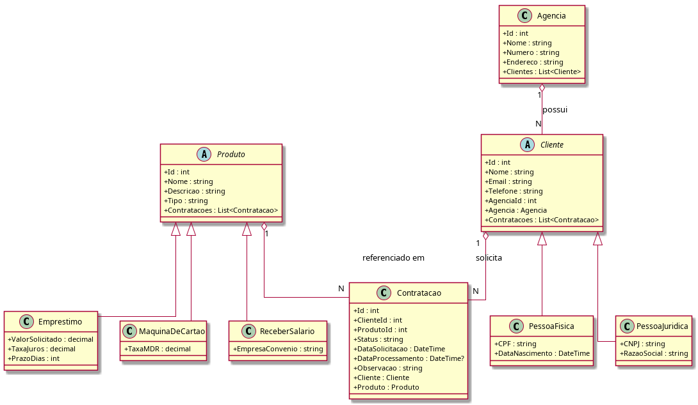
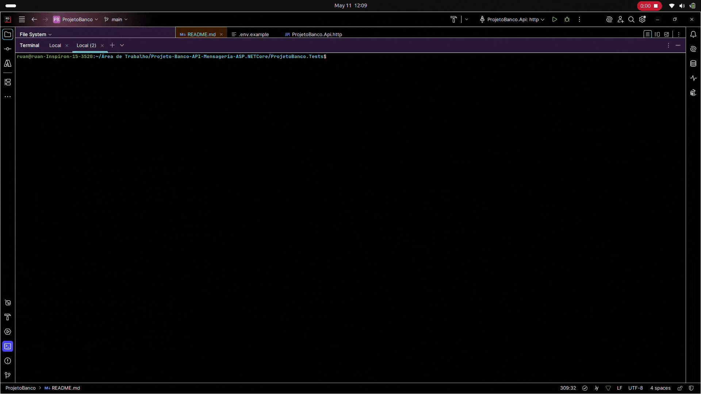
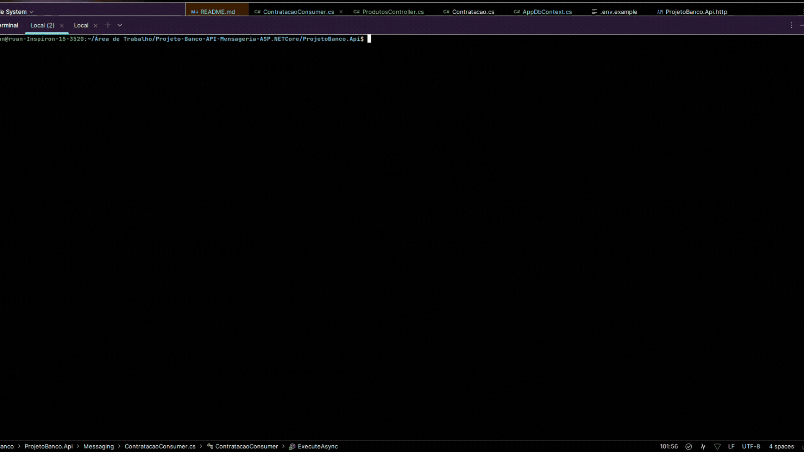
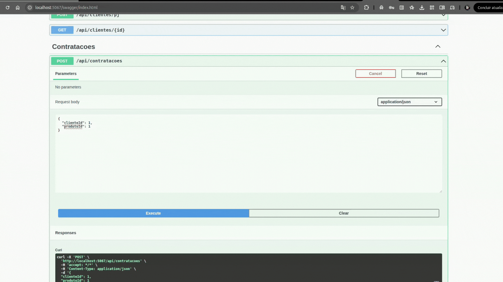

# Projeto Banco — API com Mensageria

> Backend de um banco digital construído com ASP.NET Core 8, Entity Framework Core, Oracle, RabbitMQ e OpenTelemetry.

---

## 1. Identificação

| Nome                                    | RM           |
|-----------------------------------------|--------------|
| _(Integrante 1 — Ruan Nunes Gaspar)_    | _(RM559567)_ |
| _(Integrante 2 — Rodrigo Paes Morales)_ | _(RM560209)_ |

---

## 2. Produto Bancário Escolhido

**Produto:** Empréstimo (`Emprestimo`)

**Justificativa:** O empréstimo foi escolhido por exigir a regra de negócio mais rica entre os três produtos disponíveis. Além da validação básica de campos (valor, taxa, prazo), foi implementado um **algoritmo de score financeiro** (requisito de dupla) que avalia três dimensões ponderadas:

- **Score de taxa de juros** — penaliza taxas acima de 15% a.a.
- **Score de prazo** — favorece contratos de longo prazo (≥ 360 dias)
- **Score de valor solicitado** — limita exposição a valores acima de R$ 200.000

Contratações com score total ≥ 60 são **APROVADAS**; abaixo disso, **RECUSADAS** com justificativa detalhada no campo `Observacao`.

---

## 3. Decisão de Modelagem de Filas

**Abordagem escolhida:** fila única `contratacao-solicitada` com discriminator `TipoProduto` no payload JSON.

**Trade-off considerado:**

| Critério | Fila única | N filas por produto |
|---|---|---|
| Complexidade de infraestrutura | Baixa — 1 fila para declarar | Alta — 1 fila por produto |
| Escalabilidade independente | Não (consumers disputam a fila) | Sim (cada fila tem seu consumer) |
| Simplicidade do Consumer | Necessita `switch` no payload | Consumer dedicado por produto |
| Adequação ao escopo | Projeto com 1 produto ativo | Melhor para 3+ produtos em produção |

Para um projeto individual/dupla com apenas 1 produto implementado na API, a fila única reduz overhead de infraestrutura sem perda funcional. O campo `TipoProduto` no payload permite extensão futura sem alteração de infraestrutura.

---

## 4. Diagrama de Classes



> Gerado a partir de `docs/diagrama-classes.puml`. Para regenerar: `plantuml docs/diagrama-classes.puml`

**Resumo do modelo:**
- `Cliente` é abstrata com herança TPH (tabela única) via discriminator `"Tipo"`: `PF` e `PJ`
- `Produto` é abstrata com herança TPH: `EMPRESTIMO`, `MAQUINA`, `SALARIO`
- `Agencia` possui N clientes (`1:N`)
- `Cliente` possui N contratações (`1:N`)
- `Contratacao` referencia 1 cliente e 1 produto

---

## 5. Como Rodar Localmente

### Pré-requisitos

- [.NET 8 SDK](https://dotnet.microsoft.com/download/dotnet/8.0)
- [Docker](https://www.docker.com/)
- Credenciais Oracle FIAP (RM individual)

### 1. Subir o RabbitMQ via Docker

```bash
docker-compose up -d
```

Aguarde ~10 segundos e acesse o painel de gerenciamento:
**http://localhost:15672** — usuário: `guest` / senha: `guest`

### 2. Configurar a connection string Oracle

Crie um arquivo `.env` e copie o conteúdo de `.env.example`. Altere seu user e senha do banco Oracle:

```
ORACLE_USER=RM_SEUNUMERO
ORACLE_PASSWORD=SUA_SENHA
ORACLE_HOST=oracle.fiap.com.br
ORACLE_PORT=1521
ORACLE_SERVICE=ORCL

RABBITMQ_HOST=localhost
RABBITMQ_PORT=5672
RABBITMQ_USER=guest
RABBITMQ_PASSWORD=guest
```

### 3. Aplicar as Migrations

```bash
cd ProjetoBanco.Api
dotnet ef database update
```

### 4. Rodar a API

```bash
dotnet run
```

A API estará disponível em:
- Swagger: **http://localhost:5000/swagger**
- Health Check: **http://localhost:5000/health**

---

## 6. Endpoints Disponíveis

### POST `/api/clientes/pf` — Cadastra Pessoa Física

**Request:**
```json
{
  "nome": "Carlos Eduardo",
  "email": "carlos.eduardo@email.com",
  "telefone": "11977776666",
  "agenciaId": 2,
  "cpf": "32165498700",
  "dataNascimento": "1992-03-10T00:00:00"
}
```

**cURL:**
```bash
curl -X POST "http://localhost:5067/api/clientes/pf" \
-H "Content-Type: application/json" \
-d '{
  "nome": "Carlos Eduardo",
  "email": "carlos.eduardo@email.com",
  "telefone": "11977776666",
  "agenciaId": 2,
  "cpf": "32165498700",
  "dataNascimento": "1992-03-10T00:00:00"
}'
```

**Response 201:**
```json
{
  "id": 7,
  "nome": "Carlos Eduardo",
  "email": "carlos.eduardo@email.com",
  "cpf": "32165498700",
  "agenciaId": 2
}
```

---

### POST `/api/clientes/pj` — Cadastra Pessoa Jurídica

**Request:**
```json
{
  "nome": "NovaTech",
  "email": "contato@novatech.com.br",
  "telefone": "1144556677",
  "agenciaId": 3,
  "cnpj": "99887766000144",
  "razaoSocial": "NovaTech Soluções Digitais LTDA"
}
```

**cURL:**
```bash
curl -X POST "http://localhost:5067/api/clientes/pj" \
-H "Content-Type: application/json" \
-d '{
  "nome": "NovaTech",
  "email": "contato@novatech.com.br",
  "telefone": "1144556677",
  "agenciaId": 3,
  "cnpj": "99887766000144",
  "razaoSocial": "NovaTech Soluções Digitais LTDA"
}'
```

**Response 201:**
```json
{
  "id": 8,
  "nome": "NovaTech",
  "cnpj": "99887766000144",
  "razaoSocial": "NovaTech Soluções Digitais LTDA",
  "agenciaId": 3
}
```

---

### GET `/api/clientes/{id}` — Busca Cliente por ID

**cURL:**
```bash
curl -X GET "http://localhost:5067/api/clientes/7"
```

**Response 200:**
```json
{
  "id": 7,
  "nome": "Carlos Eduardo",
  "email": "carlos.eduardo@email.com",
  "telefone": "11977776666",
  "agencia": {
    "id": 2,
    "nome": "Agência Paulista",
    "numero": "102"
  }
}
```

---

### POST `/api/agencias` — Cadastra Agência

**Request:**
```json
{
  "nome": "Agência Paulista",
  "numero": "102",
  "endereco": "Av. Brigadeiro Faria Lima, 500 — São Paulo/SP"
}
```

**cURL:**
```bash
curl -X POST "http://localhost:5067/api/agencias" \
-H "Content-Type: application/json" \
-d '{
  "nome": "Agência Paulista",
  "numero": "102",
  "endereco": "Av. Brigadeiro Faria Lima, 500 — São Paulo/SP"
}'
```

**Response 201:**
```json
{
  "id": 2,
  "nome": "Agência Paulista",
  "numero": "102",
  "endereco": "Av. Brigadeiro Faria Lima, 500 — São Paulo/SP"
}
```

---

### GET `/api/agencias/{id}` — Busca Agência por ID

**cURL:**
```bash
curl -X GET "http://localhost:5067/api/agencias/2"
```

**Response 200:**
```json
{
  "id": 2,
  "nome": "Agência Paulista",
  "numero": "102",
  "endereco": "Av. Brigadeiro Faria Lima, 500 — São Paulo/SP"
}
```

---

### POST `/api/emprestimos` — Cadastra Produto de Empréstimo

**Request:**
```json
{
  "nome": "Empréstimo Universitário",
  "descricao": "Linha de crédito para graduação e pós-graduação",
  "valorSolicitado": 45000,
  "taxaJuros": 1.9,
  "prazoDias": 540
}
```

**cURL:**
```bash
curl -X POST "http://localhost:5067/api/emprestimos" \
-H "Content-Type: application/json" \
-d '{
  "nome": "Empréstimo Universitário",
  "descricao": "Linha de crédito para graduação e pós-graduação",
  "valorSolicitado": 45000,
  "taxaJuros": 1.9,
  "prazoDias": 540
}'
```

**Response 201:**
```json
{
  "id": 1,
  "nome": "Empréstimo Universitário",
  "descricao": "Linha de crédito para graduação e pós-graduação",
  "valorSolicitado": 45000,
  "taxaJuros": 1.9,
  "prazoDias": 540
}
```

---

### POST `/api/contratacoes` — Solicita Contratação (publica na fila)

**Request:**
```json
{
  "clienteId": 7,
  "produtoId": 1
}
```

**cURL:**
```bash
curl -X POST "http://localhost:5067/api/contratacoes" \
-H "Content-Type: application/json" \
-d '{
  "clienteId": 7,
  "produtoId": 1
}'
```

**Response 202:**
```json
{
  "id": 12,
  "status": "PENDENTE"
}
```

---

### GET `/api/contratacoes/{id}` — Consulta Status da Contratação

**cURL:**
```bash
curl -X GET "http://localhost:5067/api/contratacoes/12"
```

**Response 200 (após processamento):**

```json

{
  "id": 12,
  "clienteId": 7,
  "produtoId": 1,
  "status": "APROVADA",
  "dataSolicitacao": "2026-05-11T19:35:00Z",
  "dataProcessamento": "2026-05-11T19:35:02Z",
  "observacao": "Solicitação aprovada após análise automática.",
  "cliente": {
    "id": 3,
    "nome": "John Shepherd",
    "email": "js@email.com",
    "telefone": "5232344345",
    "agenciaId": 2,
    "agencia": null,
    "contratacoes": [null]
  },
  "produto": {
    "id": 1,
    "nome": "Empréstimo Pessoal",
    "descricao": "Crédito Pessoal",
    "contratacoes": [null]
  }
}
```

---

### GET `/health` — Health Check

**cURL:**
```bash
curl -X GET "http://localhost:5067/health"
```

**Response 200:**
```json
{
  "status": "Healthy",
  "entries": {
    "AppDbContext": {
      "status": "Healthy"
    }
  }
}
```
---

## 7. Como Executar os Testes

```bash
cd ProjetoBanco.Tests
dotnet test --verbosity normal
```

### Fluxos cobertos

| Teste | Cenário |
|---|---|
| `CadastrarPF_Valido_Retorna201` | Cadastro de PF válida |
| `CadastrarPF_CPFDuplicado_Retorna400` | CPF já existente → 400 |
| `CadastrarPJ_Valido_Retorna201` | Cadastro de PJ válida |
| `CadastrarPJ_CNPJDuplicado_Retorna400` | CNPJ já existente → 400 |
| `CadastrarCliente_AgenciaInexistente_Retorna404` | Agência inválida → 404 |
| `SolicitarContratacao_Valida_Retorna202` | Contratação aceita e publicada na fila |
| `SolicitarContratacao_ClienteInexistente_Retorna404` | Cliente inexistente → 404 |
| `ConsultarContratacao_Existente_RetornaStatus` | Consulta de status via GET |

> Todos os testes usam `WebApplicationFactory<Program>` com Oracle substituído por banco InMemory e RabbitMQ mockado via Moq.

**Terminal de Testes:**

---

## 8. Painel do RabbitMQ

Acesse **http://localhost:15672** → aba **Queues** → fila `contratacao-solicitada`.

**Painel com mensagens processadas:**


---

## 9. Swagger com Contratação Aprovada


**Swagger com contratação aprovada:**


---

## 10. Stack Tecnológica

| Camada | Tecnologia |
|---|---|
| Runtime | .NET 8.0 |
| API | ASP.NET Core Web API |
| ORM | Entity Framework Core 8 |
| Banco | Oracle (`oracle.fiap.com.br:1521/ORCL`) |
| Logging | Serilog (console + arquivo em `logs/`) |
| Health Checks | `AspNetCore.HealthChecks.UI.Client` + `AddDbContextCheck` |
| Observabilidade | OpenTelemetry com exporter Console |
| Mensageria | RabbitMQ 3-management via Docker + `RabbitMQ.Client 6.8.1` |
| Testes | xUnit + Moq + `WebApplicationFactory<Program>` |

---

## 11. Estrutura de Pastas

```
ProjetoBanco/
├── docker-compose.yml
├── docs/
│   └── diagrama-classes.puml
├── ProjetoBanco.Api/
│   ├── Program.cs
│   ├── appsettings.json
│   ├── Controllers/
│   │   ├── ClientesController.cs
│   │   ├── AgenciasController.cs
│   │   └── ContratacoesController.cs
│   ├── Data/
│   │   └── AppDbContext.cs
│   ├── Domain/
│   │   ├── Cliente.cs
│   │   ├── PessoaFisica.cs
│   │   ├── PessoaJuridica.cs
│   │   ├── Agencia.cs
│   │   ├── Produto.cs
│   │   ├── Emprestimo.cs
│   │   ├── MaquinaDeCartao.cs
│   │   ├── ReceberSalario.cs
│   │   └── Contratacao.cs
│   ├── DTOs/
│   ├── Messaging/
│   │   ├── IRabbitMqService.cs
│   │   ├── RabbitMqService.cs
│   │   └── ContratacaoConsumer.cs
│   └── Services/
│       └── EmprestimoService.cs
└── ProjetoBanco.Tests/
    ├── CustomWebApplicationFactory.cs
    ├── ClientesControllerTests.cs
    └── ContratacoesControllerTests.cs
```